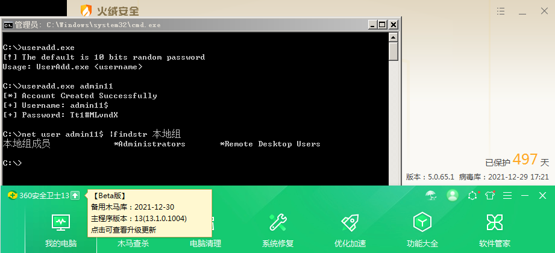

## Introduce

[Bypass AV 添加用户](https://payloads.cn/2021/1230/bypass-av-add-user.html)

**UserAdd.exe**

```tex
[!] The default is 10 bits random password
Usage: UserAdd.exe <username>
```



1. 利用`DirectoryService` 命名空间添加用户
2. 将用户添加到管理员与远程桌面组
3. Bypass AV

------

### Reference

- [使用目录服务和 Visual C 升在本地系统中添加用户](https://docs.microsoft.com/zh-cn/troubleshoot/dotnet/csharp/add-user-local-system)